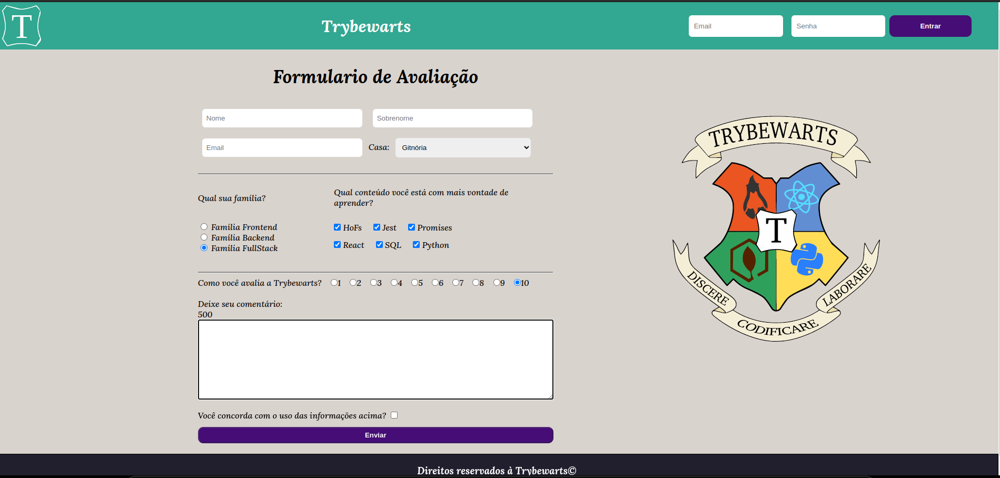

<!-- Olá, Tryber!
Esse é apenas um arquivo inicial para o README do seu projeto.
É essencial que você preencha esse documento por conta própria, ok?
Não deixe de usar nossas dicas de escrita de README de projetos, e deixe sua criatividade brilhar!
:warning: IMPORTANTE: você precisa deixar nítido:
- quais arquivos/pastas foram desenvolvidos por você; 
- quais arquivos/pastas foram desenvolvidos por outra pessoa estudante;
- quais arquivos/pastas foram desenvolvidos pela Trybe.
-->

<h1 align="center">Trybewarts</h1>

  
Neste projeto, foi desenvolvido uma página de formulário da Escola de Magia de Trybewarts, em que as pessoas estudantes poderão enviar seus feedbacks sobre ela. O tema desse projeto é baseado na obra 'Harry Potter', de J. K. Rowling, já que programar é o mais próximo que podemos chegar de algo verdadeiramente mágico! Mas não se preocupe se não tiver conhecimento sobre o universo da obra original, pois essa é uma versão própria da Escola de Bruxaria e você terá todas as informações necessárias para entendê-la. 
  

  
 [Link Para Visualizar](https://project-trybewarts-theta.vercel.app/)
 

  
<strong>🛠 Tecnologias utilizadas</strong>
 
### 🛠 Tecnologias

As seguintes ferramentas foram usadas na construção do projeto:

- [CSS](https://developer.mozilla.org/pt-BR/docs/Web/CSS)
- [HTML](https://developer.mozilla.org/pt-BR/docs/Web/HTML)
- [JavaScript](https://developer.mozilla.org/pt-BR/docs/Web/JavaScript)
 

  
<strong>🧑‍💻 Habilidades</strong>
 
### 🧑‍💻 Tecnologias

As seguintes habilidades foram necessárias para a realização desse projeto:

- Manipulação de formulários e inputs.
- JavaScript Vanilla com manipulação de DOM
- Estilização com CSS Vanilla

  

  
<strong>🏪 O que foi desenvolvido</strong>
 
<h1 align="center">
  
</h1>
  

